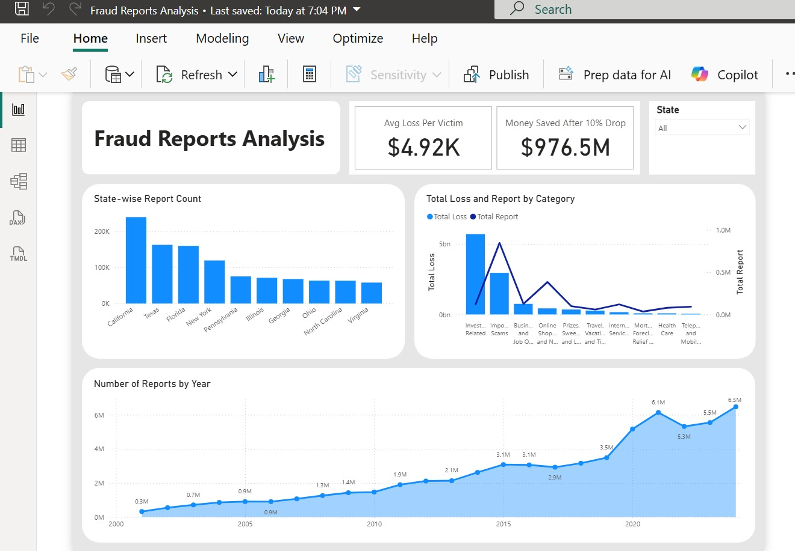

# 📊 Fraud Reports Analysis (Power BI Project)

A Power BI dashboard analyzing U.S. fraud report trends (2024).  
Includes insights by **state**, **year**, and **fraud category** based on real FTC data.

---

## 🔍 Key Insights
- California and Texas have the highest number of reported fraud cases.  
- Investment and Imposter scams cause the largest total losses.  
- Average loss per victim: **$4.92K**  
- Estimated savings after 10% reduction: **$976.5M**

---

## 🧠 Tools & Technologies
- Power BI (Data Visualization)
- CSV Datasets
- Microsoft Excel (Data Cleaning)

---

## 📂 Files Included
- `Fraud Reports Analysis.pbix`
- `2024_CSN_Report_Count.csv`
- `2024_CSN_Report_Type.csv`
- `2024_CSN_State_Fraud_Reports_and_Losses.csv`
- `dashboard.jpeg`

---

## 🖼️ Dashboard Preview

---

*Developed by **Istiaque Mahmud** | Wichita Falls, TX, USA*
